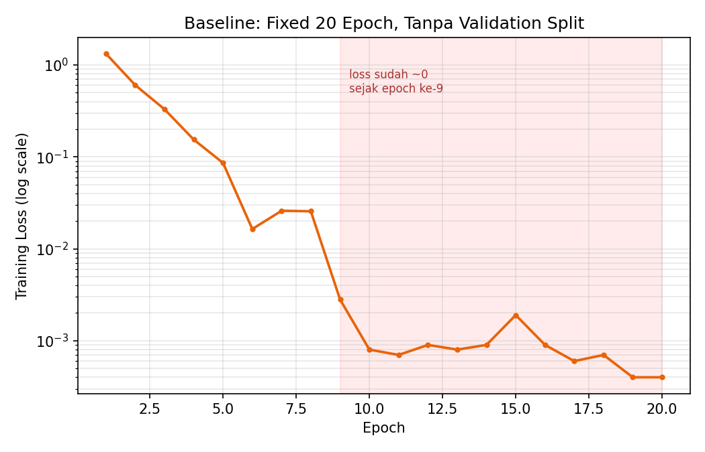
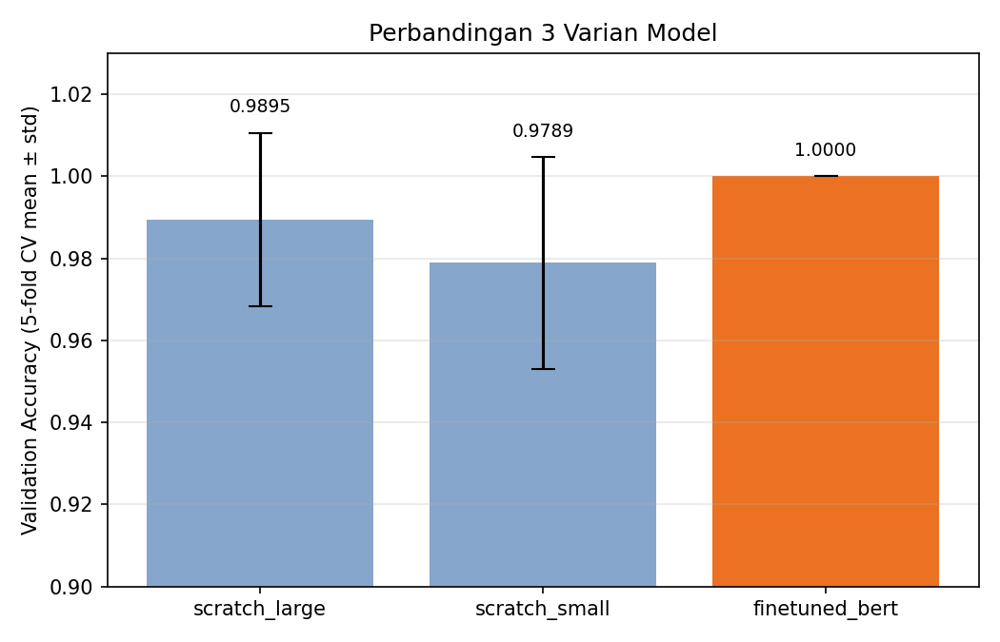

# Transformer Encoder untuk Intent Classification (Bahasa Indonesia)

Implementasi Transformer Encoder untuk klasifikasi intent teks berbahasa Indonesia — mempraktikkan konsep Positional Encoding, Multi-Head Self-Attention, dan Encoder architecture, sekaligus investigasi dan penanganan overfitting lewat cross-validation, early stopping, dan perbandingan dengan pendekatan transfer learning.

## Isi

- `transformer_intent_classification.ipynb` — notebook lengkap (data, model, training, evaluasi, serving)
- `assets/` — grafik hasil eksperimen
- `requirements.txt` — dependencies

## Arsitektur

Dua komponen inti diimplementasikan dari konsep Transformer:

- **Positional Encoding** — rumus sinusoidal standar (`sin`/`cos` berdasarkan posisi dan dimensi)
- **TransformerClassifier** — encoder-only, memakai `nn.TransformerEncoder` (multi-head self-attention + feed-forward + residual/layer-norm) di atas embedding dari tokenizer BERT Bahasa Indonesia

Tiga varian model dibandingkan:

| Varian | Deskripsi |
|---|---|
| `scratch_large` | Transformer 6 layer, hidden dim 768, dilatih dari nol |
| `scratch_small` | Transformer 2 layer, hidden dim 128, dropout & weight decay lebih tinggi |
| `finetuned_bert` | Fine-tuning bobot BERT Indonesia pretrained (`cahya/bert-base-indonesian-522M`) |

## Metodologi: Investigasi Overfitting

Percobaan awal (training 20 epoch tetap, tanpa validation split) menunjukkan tanda overfitting yang jelas — training loss turun ke hampir nol sejak epoch ke-9:



Untuk mengatasi ini, tiga varian model dibandingkan dengan **5-fold Stratified Cross-Validation**, masing-masing memakai **validation split + early stopping** (training berhenti saat validation loss berhenti membaik):



## Hasil (terverifikasi, hasil eksekusi aktual)

| Varian | CV Accuracy (mean ± std) | Per fold |
|---|---|---|
| scratch_large | 0.9895 ± 0.0211 | [1.0, 1.0, 1.0, 0.947, 1.0] |
| scratch_small | 0.9789 ± 0.0258 | [1.0, 0.947, 1.0, 0.947, 1.0] |
| **finetuned_bert** | **1.0000 ± 0.0000** | [1.0, 1.0, 1.0, 1.0, 1.0] |

Model terpilih (`finetuned_bert`) dilatih ulang di seluruh data dan mencapai akurasi 100% pada validation set akhir (15 sampel), dengan precision/recall/f1 sempurna di ketiga kelas.

Early stopping + validation split terbukti berdampak nyata: model `scratch_large` yang sama, tanpa perubahan arsitektur, naik dari akurasi single-split ~89–95% (pendekatan awal) menjadi rata-rata CV 98,95% setelah training-nya diperbaiki.

## Keterbatasan (penting dibaca sebelum menyimpulkan apa pun)

Skor yang nyaris sempurna di semua varian — termasuk model yang sengaja diperkecil — bukan berarti task ini sudah "diselesaikan dengan sangat baik". Dataset ini kecil (94 sampel, 3 kelas) dan **lexically sangat mudah dipisahkan**: analisis vocabulary overlap antar kelas menunjukkan hanya 5-6 kata yang sama antar kelas (Jaccard similarity 0,08–0,10), dan kata-kata itu semuanya kata fungsi umum ("ada", "bisa", "ini", "yang") — bukan kata kunci. Kata konten tiap kelas (`jam/waktu/pukul`, `siapa/nama/dirimu`, `hi/halo/selamat`) nyaris tidak beririsan sama sekali.

Tidak ditemukan duplikasi data (0 baris duplikat persis) yang bisa menjelaskan skor tinggi ini lewat data leakage.

Artinya: hasil ini adalah bukti valid bahwa metodologinya (cross-validation, early stopping, transfer learning) bekerja dengan benar — bukan klaim bahwa modelnya "hebat" secara umum. Dataset yang lebih besar dan lebih ambigu kemungkinan akan menunjukkan perbedaan yang lebih jelas antar ketiga varian.

## Menjalankan

```bash
pip install -r requirements.txt
```

Buka `transformer_intent_classification.ipynb` di Jupyter/Google Colab (disarankan runtime GPU untuk bagian fine-tuning BERT) dan jalankan seluruh cell secara berurutan.

## API

Notebook menyertakan serving lewat FastAPI + ngrok:

```bash
POST /predict
{"text": "Siapa nama kamu?"}

POST /predict_batch
{"texts": ["Nama kamu siapa?", "Selamat malam"]}
```
